<picture>
  <source media="(prefers-color-scheme: dark)" srcset="assets/wordmark-dark.svg">
  
</picture>

  
  
  
  
  
  
  

<picture>
  <source media="(prefers-color-scheme: dark)" srcset="https://raw.githubusercontent.com/uziii2208/uziii2208/output/github-contribution-grid-snake.svg">
  
</picture>

